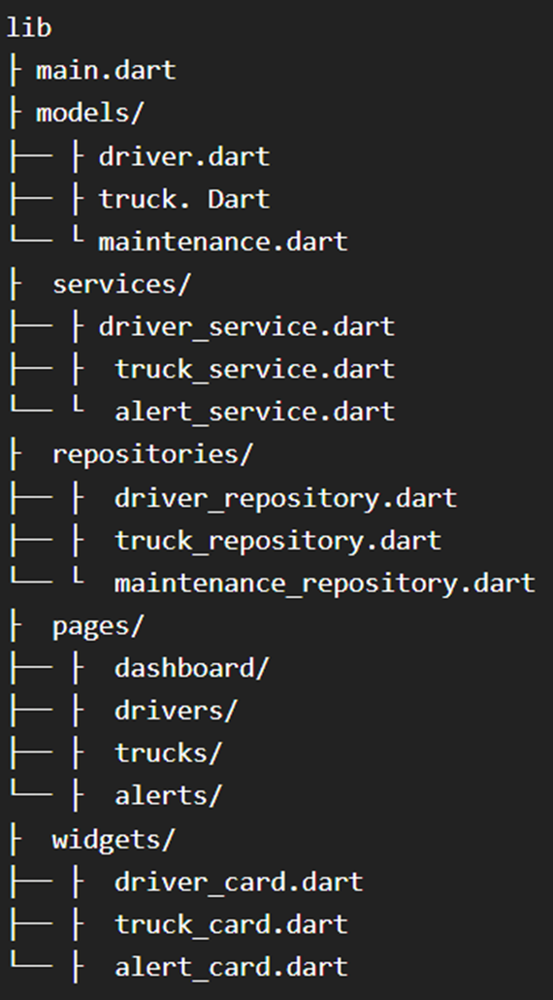
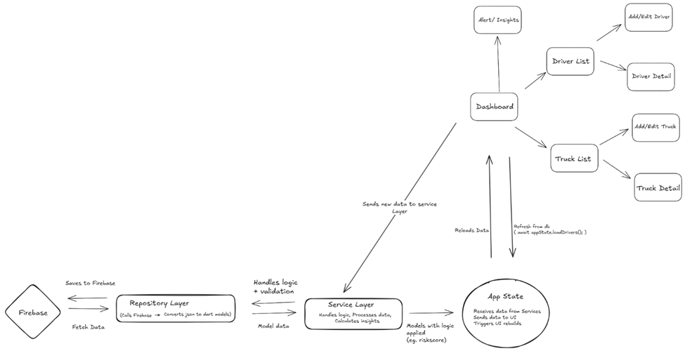
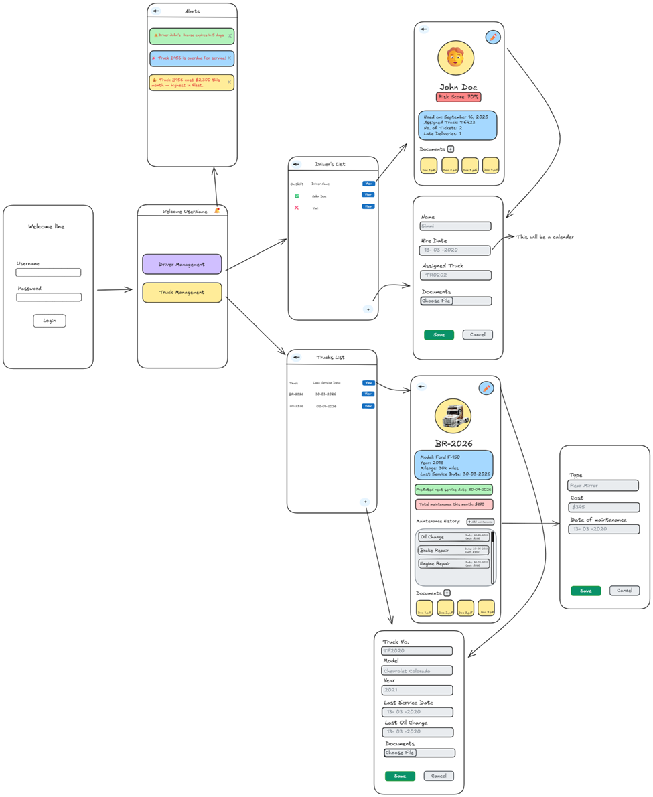

Title: TruckIQ
Name: Gursimar Kaur
Date Completed: April 2, 2026
 

## **Purpose:** 
The proposed application is a mobile-based trucking management system built using Flutter and Dart. It is designed to help trucking company owners efficiently manage employee records, vehicle data, maintenance schedules, and performance insights in a centralized platform.

### Functionality: 
The trucking record app will include the following key features:
- Driver Management
Store and manage driver information such as hire date, license details, tickets, and incident history. 
- Truck Management
Maintain truck records including vehicle details, service history, oil changes, repairs, and inspection logs. 
- Notifications & Alerts
Send alerts for maintenance due dates, document expirations, and performance issues. 
Stretch Goals:
- Fuel Tracking
Monitor fuel usage and identify changes or inefficiencies over time. 
- Performance Reports
Generate monthly reports showing driver performance, ticket frequency, and truck efficiency. 
- Smart Insights 
Display automated insights such as high-risk drivers, costly vehicles, and unusual fuel usage trends. 
- Dashboard
Provide an overview of key metrics like total drivers, active trucks, maintenance status, and performance summaries.

### Timeline: 
April 3 – April 8
- Setup flutter, Firebase, db structure
- Driver Management 
- Dashboard

April 9 – April 13
- Truck Management 
April 14 - April 17 
- Notification Alerts

### Directory Structure

 
### Third Party Packages: 
Firebase

### Architecture

### User Flow:
User logs in → See Dashboard  →  Selects Driver management  →  Sees all drivers  →  Click on “View”  → Sees Driver details view page  → Clicks “Edit” icon  → Sees driver edit page → Click “Save” → Sees driver list page  → Clicks “+” icon  →  sees add new driver page → Hits “save”  → Goes back to driver list page  
Clicks Truck management on Dashboard → Sees list of trucks  → Clicks “View”  → Sees Truck Details view page  → Clicks “Edit” icon  → Sees truck info edit page → Click “Save” icon  → Sees truck list page  → Clicks “+” icon  →  sees add new truck page → Hits “save”  → Goes back to truck list page  
User clicks on “Bell” icons  →  sees all alerts and insights

### Wireframe:

 
